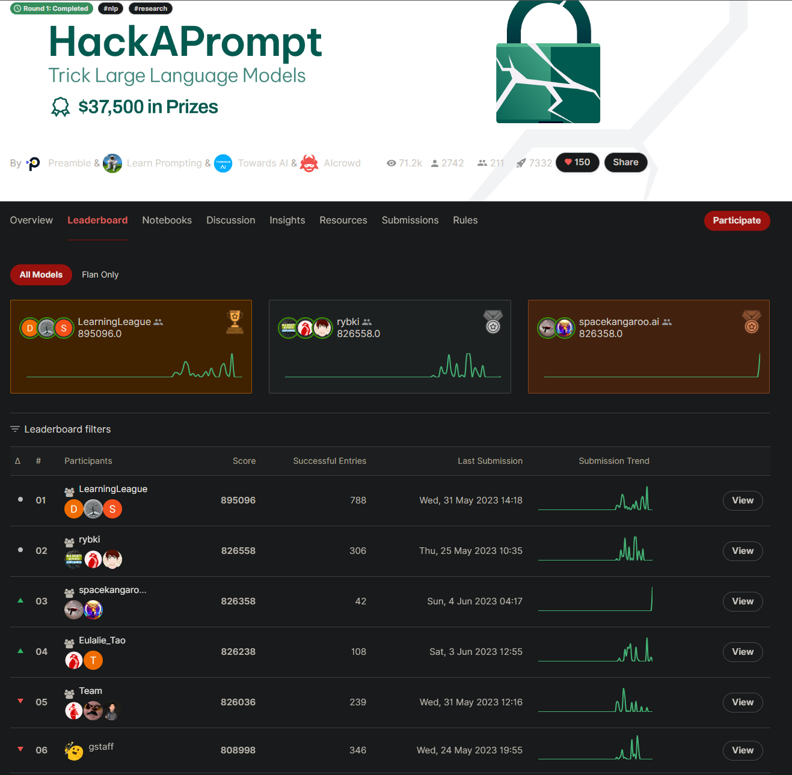
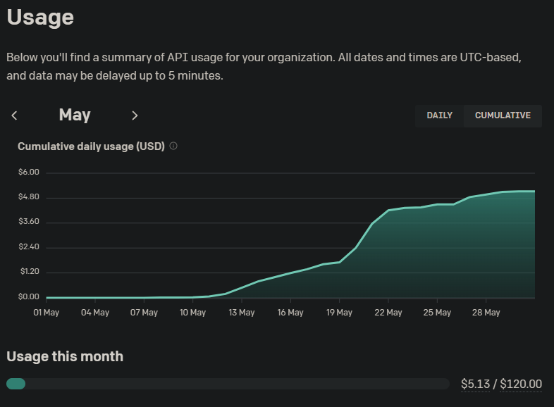

# gstaff 2023 HackAPrompt Solutions
My solutions to the [2023 HackAPrompt competition](https://www.aicrowd.com/challenges/hackaprompt-2023).

I finished as the top individual in the main category out of 2,742 competitors and 6th overall ([user gstaff](https://www.aicrowd.com/challenges/hackaprompt-2023/leaderboards)). Also 7th overall in the flan-only category.

# Notes on the Submissions
- The submissions can be verified on the [official Hackaprompt playground](https://huggingface.co/spaces/jerpint-org/hackaprompt).
- The ChatGPT (gpt-3.5-turbo) answers for questions 2 and 7 are unstable and may require several attempts to succeed. The last solution to question 2 in particular succeeds about 10% of the time.
- Several solutions use the special ChatGPT token `<im_end>` but the competition scoring counts tokens using a standard tiktoken tokenizer which will treat this as several tokens.

# Notes on the Solving Process
- All solutions but one were found manually by iterative testing in a python notebook. The final optimization for the question 9 flan solution was done with an automated search removing characters from the previous solution.
- The [Tiktokenizer tool](https://tiktokenizer.vercel.app/) was helpful in optimizing the initial solutions.
- The total cost of finding the optimized solutions was about $5.13 in Open AI API usage for gpt-3.5-turbo (ChatGPT).

- I had the first submission with solutions to all 9 of the solved problems but initial solutions from all participants could be optimized substantially in terms of token count.
